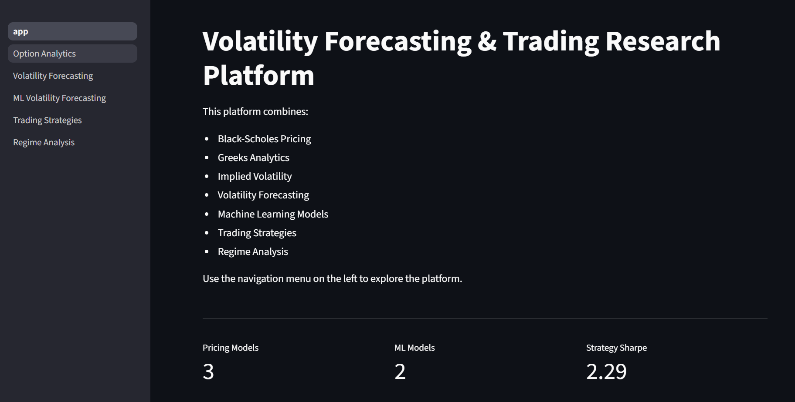
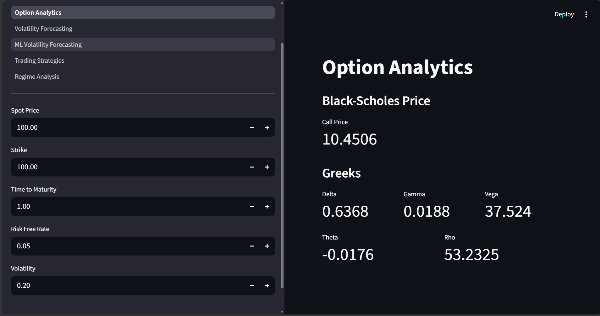
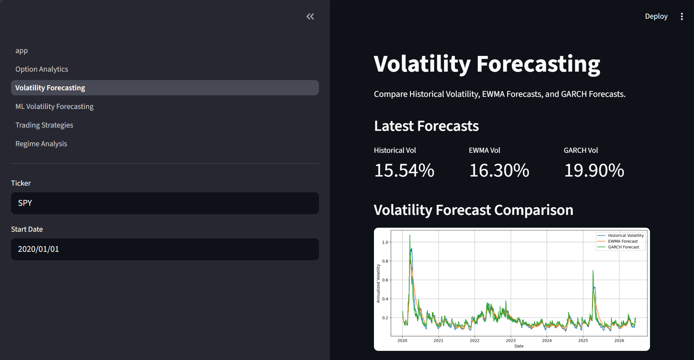
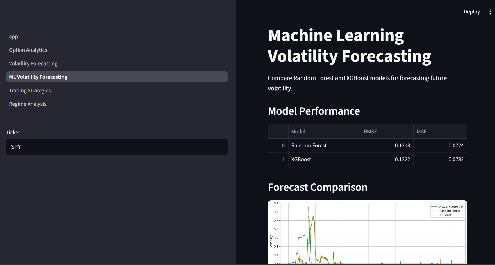
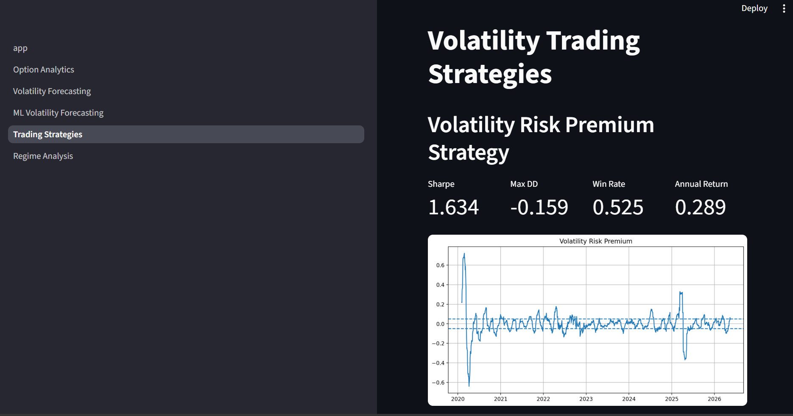
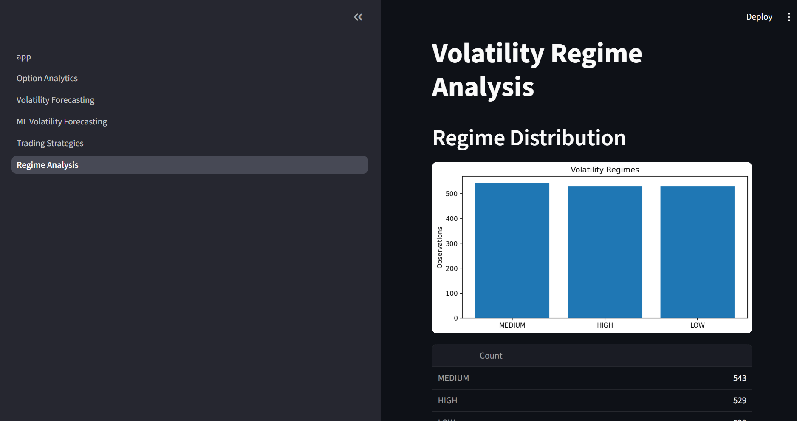

# Option Pricing & Volatility Forecasting Research Platform

## Overview

This project is a quantitative research platform for option pricing, volatility modeling, machine learning-based volatility forecasting, and systematic volatility trading strategies.

The platform combines classical derivatives pricing techniques with modern statistical and machine learning methods to analyze, forecast, and trade market volatility.

The project evolved from a pricing engine into a complete research workflow including:

- Option Pricing
- Greeks Analytics
- Numerical Pricing Methods
- Implied Volatility Extraction
- Volatility Smile & Skew Analysis
- Volatility Surface Construction
- Volatility Forecasting
- Machine Learning Models
- Walk-Forward Validation
- Systematic Trading Strategies
- Volatility Regime Analysis
- Interactive Streamlit Dashboard

---

## Live Application

The project is deployed as an interactive Streamlit dashboard and can be accessed here:

🔗 **Live Demo:** https://option-pricing-volatility-engine-89zfnt4sfzkwwrur5z7mgo.streamlit.app/

### Dashboard Modules

#### 1. Option Analytics
- Black-Scholes Option Pricing
- Greeks Calculation (Delta, Gamma, Vega, Theta, Rho)
- Interactive parameter controls
- Real-time pricing updates

#### 2. Volatility Forecasting
- Historical Volatility
- EWMA Volatility Forecasting
- GARCH(1,1) Volatility Modeling
- Comparative volatility analysis

#### 3. Machine Learning Forecasting
- Random Forest Volatility Forecasting
- XGBoost Volatility Forecasting
- Feature Importance Analysis
- Model Performance Comparison

#### 4. Volatility Trading Strategies
- Volatility Risk Premium Strategy
- Forecast Spread Strategy
- Backtesting Framework
- Performance Metrics (Sharpe Ratio, Drawdown, Win Rate, Annual Return)

#### 5. Regime Analysis
- Volatility Regime Classification
- Regime Distribution Analysis
- Regime-Based Strategy Filtering
- Transition Analysis


## Dashboard Preview

### Home Page



### Option Analytics



### Volatility Forecasting



### Machine Learning Volatility Forecasting



### Trading Strategies



### Regime Analysis




## Project Architecture

```text
option_pricing_volatility_engine/

├── pricing/
├── volatility/
├── forecasting/
├── strategies/
├── backtests/
├── research/
├── surface/
├── visualization/
├── data/
├── pages/
├── experiments/

├── app.py
├── requirements.txt
└── README.md
```

---

## Features

### Option Pricing Engine

Implemented:

- Black-Scholes Option Pricing
- European Call Pricing
- Put-Call Parity Validation

### Greeks & Risk Analytics

Implemented analytical and finite-difference Greeks:

- Delta
- Gamma
- Vega
- Theta
- Rho

### Numerical Pricing Methods

Implemented:

- Binomial Tree Pricing
- Monte Carlo Simulation

Validation included convergence analysis against Black-Scholes benchmarks.

### Implied Volatility Engine

Implemented:

- Bisection Solver
- Newton-Raphson Solver

Market option prices can be converted into implied volatility estimates.

### Volatility Research

Implemented:

- Volatility Smile Analysis
- Volatility Skew Analysis
- Term Structure Analysis
- Volatility Surface Construction

### Volatility Forecasting

Implemented:

- Historical Volatility
- EWMA Volatility
- GARCH(1,1)

### Machine Learning Forecasting

Feature set:

- 1-Day Returns
- 5-Day Returns
- 21-Day Returns
- Historical Volatility
- EWMA Volatility
- GARCH Volatility

Models:

- Random Forest Regressor
- XGBoost Regressor

### Walk-Forward Validation

Implemented expanding-window walk-forward testing to evaluate forecasting performance under realistic market conditions.

### Volatility Trading Strategies

Implemented:

#### Volatility Risk Premium Strategy

Signal generated from:

IV − Realized Volatility

#### Forecast Spread Strategy

Signal generated from:

IV − Forecast Volatility

Performance evaluated through transaction-cost-aware backtesting.

### Regime Analysis

Volatility environments classified into:

- LOW Volatility
- MEDIUM Volatility
- HIGH Volatility

Research included:

- Regime Performance Analysis
- Regime Filtering
- Regime Transition Analysis

---

## Key Results

### Walk-Forward XGBoost Strategy

| Metric | Value |
|----------|----------:|
| Sharpe Ratio | 2.161 |
| Maximum Drawdown | -10.8% |
| Win Rate | 51.1% |
| Annual Return | 34.5% |

### Regime Filtered Strategy

| Metric | Original | Filtered |
|----------|----------:|----------:|
| Sharpe Ratio | 2.05 | 2.29 |
| Maximum Drawdown | -24.5% | -7.3% |

Filtering out high-volatility environments improved risk-adjusted performance while significantly reducing drawdowns.

---

## Streamlit Dashboard

The platform includes a multi-page Streamlit dashboard.

### Pages

1. Option Analytics
2. Volatility Forecasting
3. ML Volatility Forecasting
4. Trading Strategies
5. Regime Analysis

---


## Installation

Clone the repository:

```bash
git clone <repository-url>
cd option_pricing_volatility_engine
```
 
Install dependencies:

```bash
pip install -r requirements.txt
```

---

## Run Dashboard

```bash
streamlit run app.py
```

---

## Technologies Used

- Python
- Stramlit
- NumPy
- Pandas
- Scikit-Learn
- XGBoost
- ARCH
- yfinance
- matplotlib
- plotly

---

## Future Work

Potential extensions include:

- EGARCH and GJR-GARCH Models
- Heston Stochastic Volatility Model
- LSTM-Based Volatility Forecasting
- Transformer Time-Series Models
- Real-Time Option Data Integration
- Portfolio-Level Volatility Trading
- Cloud Deployment

---

## Author

Frreyah

